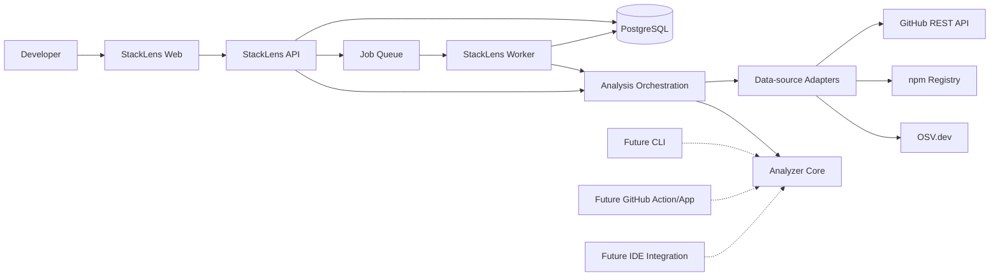
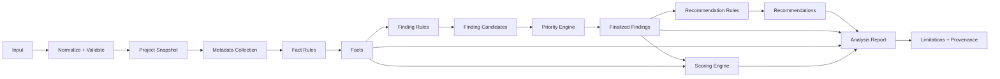
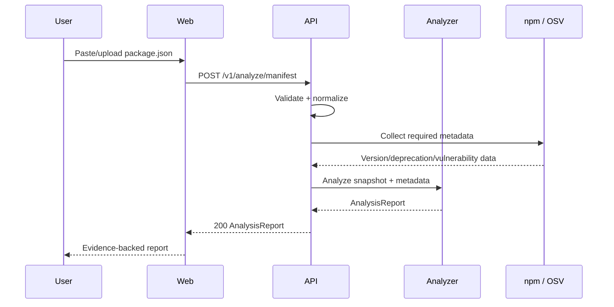
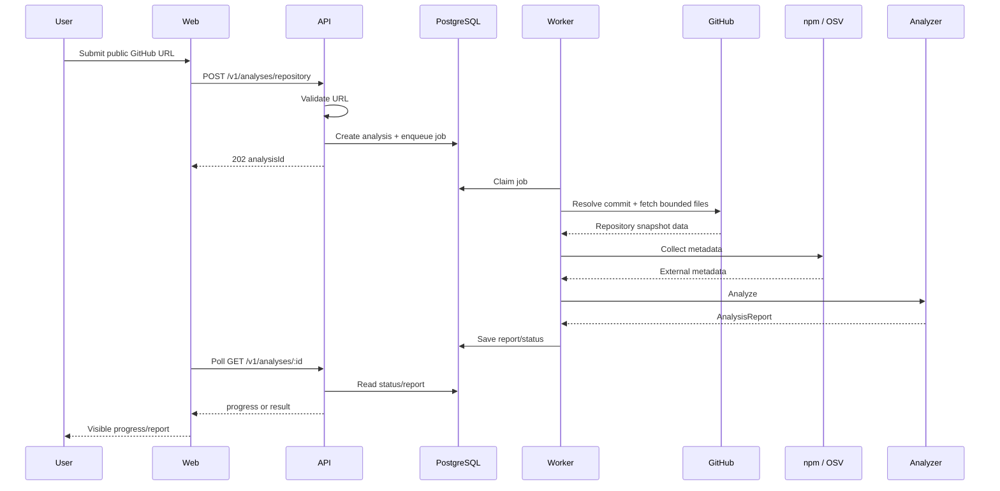

# StackLens System Architecture

> **Status:** Accepted baseline  
> **Architecture version:** 0.1.13  
> **Date:** 2026-09-21  
> **Requirements source:** [requirements.md](requirements.md)  
> **Primary requirements:** PRD-001–PRD-007, FR-001–FR-022, DATA-001–DATA-006, SCORE-001–SCORE-004, SEC-001–SEC-008, NFR-001–NFR-009, GOV-006–GOV-007

## 1. Architecture summary

StackLens will be implemented as a **TypeScript modular monolith with an independently reusable deterministic analyzer core**.

The hosted product has three runtime applications:

1. **Web** — React single-page application.
2. **API** — Fastify HTTP API for validation, orchestration, report delivery, and future authentication.
3. **Worker** — background Node.js process for public-repository analyses and later monitoring tasks.

The analyzer itself is **not** coupled to any of those applications. It lives in reusable workspace packages and accepts normalized project snapshots plus normalized external metadata. This is required so the same analyzer can later power the web product, CLI, GitHub automation, and IDE integration without duplicating product logic (**NFR-004**, **NFR-005**, **FR-108–FR-110**).

The MVP is deliberately **not** a microservice architecture. The system has clear module boundaries but is deployed as a small number of processes. This minimizes operational complexity while preserving future extraction boundaries.

## 2. Architectural goals

The architecture must make the following requirements structurally difficult to violate:

- recommendations must be backed by evidence (**PRD-001**, **FR-015**, **FR-017**);
- analysis and scoring must remain deterministic (**PRD-002**, **NFR-001**, **SCORE-001**);
- facts, heuristics, and recommendations must remain distinct (**PRD-003**, **DATA-005**);
- uncertainty and unsupported evidence must remain visible (**PRD-004**, **FR-021**, **SCORE-003**);
- repository code must never be executed by the MVP analyzer (**SEC-001**);
- analyzed inputs must be treated as untrusted (**SEC-002**);
- analyzer logic must be independently testable (**NFR-002**);
- external-source failure must degrade gracefully rather than invalidate unrelated findings (**NFR-003**);
- future ecosystems and clients must reuse the same finding contracts (**NFR-004**, **NFR-005**).

## 3. System context



External services are accessed only through explicit adapters before analyzer execution. Analyzer-core
and ecosystem rules never call GitHub/npm/OSV directly.

## 4. Runtime containers

### 4.1 Web application

**Responsibilities**

- accept `package.json` paste/upload input (**FR-001**, **FR-002**);
- accept public GitHub repository URLs (**FR-003**);
- validate obvious client-side input while treating server validation as authoritative (**FR-004**);
- display analysis progress (**NFR-008**);
- render findings, evidence, limitations, priorities, and scoring explanations (**FR-015–FR-021**);
- meet the accessibility and responsive requirements (**NFR-006**, **NFR-007**).

**Must not**

- contain authoritative analyzer/scoring rules;
- call npm/OSV/GitHub directly for product analysis;
- infer findings independently of the analyzer report.

The production implementation is `apps/web`, a React 19 + Vite SPA. TanStack Router owns stable
product routes and TanStack Query owns repository-analysis server state. The web transport adapter
consumes only the public Fastify contract, forwards cancellation to fetch, and runtime-validates
terminal reports with `@stacklens/contracts`.

Repository polling stops at terminal StackLens states. Presentation may map coarse server stages to
human-readable labels, but it must not invent percentage progress or reconstruct queue internals.
Report screens consume persisted analyzer priority, confidence, evidence, recommendations, and
scores as data; React does not derive replacements for those policies.

See [Repository Analysis Web Flow](implementation/repository-web.md).

### 4.2 API application

**Responsibilities**

- expose versioned REST endpoints;
- perform authoritative request validation;
- run fast manifest analyses in-process;
- create repository-analysis jobs;
- expose repository-analysis status/results;
- enforce input/resource limits;
- map application errors to stable API errors;
- publish an OpenAPI contract;
- own future authentication/session integration.

The API is a transport/job-management boundary, not the home of rule logic. Quick
`package.json` analysis is exposed synchronously at `POST /v1/analyze/manifest` through a strict
Zod/OpenAPI contract and delegates to the framework-independent quick-manifest service. It does not
use PostgreSQL or Graphile Worker. The reusable long-running repository workflow is implemented in
`@stacklens/analysis-orchestration` so API and Worker do not depend on each other's application
package.

### 4.3 Worker application

**Responsibilities**

- process asynchronous public-repository analyses;
- resolve an immutable repository reference/commit;
- build a bounded repository snapshot without executing repository code;
- invoke the shared `@stacklens/analysis-orchestration` repository workflow;
- collect required external metadata through that workflow's provider dependencies;
- persist only the report/job metadata required by policy;
- record progress and material partial failures.

Keeping repository analysis in a worker satisfies **NFR-008** without making API requests depend on hosting request-time limits.

### 4.4 PostgreSQL

PostgreSQL is the only required stateful infrastructure component for the hosted application.

MVP uses it for:

- repository-analysis jobs/status and active Graphile execution ownership;
- transient/report metadata needed for asynchronous delivery;
- structured analysis reports when configured for hosted retention;
- schema/rule/scoring version metadata;
- operational records required for reliable job processing.

Quick `package.json` analysis should remain capable of running without persistence.

Future use includes saved repositories, analysis history, user/account data, monitoring state, and notification state (**FR-100–FR-103**).

### 4.5 Background job system

Repository analyses are jobs backed by PostgreSQL.

The job system exists to:

- survive API process restarts;
- separate bounded repository fetching from request handling;
- support retries for transient external failures;
- expose progress/status;
- provide the foundation for later monitoring (**FR-103**).

The job payload must contain references/metadata rather than full private source content whenever possible (**SEC-003**, **SEC-004**).

### 4.6 Shared analysis orchestration

`@stacklens/analysis-orchestration` is the transport- and persistence-independent application
composition layer shared by hosted runtimes.

It owns:

- production analyzer composition;
- bounded repository/provider sequencing;
- construction of normalized project/metadata/evidence inputs;
- application-level progress events;
- preservation of typed provider partial failures before analyzer execution.

It does not own provider HTTP internals, finding/priority/recommendation/scoring formulas, Fastify,
Graphile Worker registration, PostgreSQL repositories, or React behavior.

This prevents Worker → API or API → Worker dependencies while keeping one authoritative hosted
repository-analysis flow (**NFR-003**, **NFR-004**, **NFR-005**, **NFR-008**).

## 5. Analyzer architecture

### 5.1 Core pipeline



The pipeline is staged so deterministic rules receive explicit inputs rather than reaching into global state or performing hidden I/O.

### 5.2 Project snapshot

A normalized `ProjectSnapshot` represents what StackLens actually observed.

Examples:

- manifest content;
- dependency groups and ranges;
- lockfile metadata when supported;
- repository owner/name;
- immutable commit SHA;
- supported configuration files;
- supported source-file text required for static import analysis;
- detected package manager/workspace indicators.

The snapshot records its own limitations. Missing files are not represented as negative findings unless absence itself is directly observable and relevant.

### 5.3 External metadata snapshot

External data is collected into normalized, timestamped records before rule evaluation.

Initial providers:

- npm public registry — package/version/deprecation/repository metadata;
- OSV.dev — known vulnerability records;
- GitHub REST API — public repository metadata and source/configuration retrieval.

Every external record carries provenance and retrieval time (**DATA-001**, **DATA-002**).

### 5.4 Rules

Each rule-stage component has a stable identifier, version, and requirement declaration.

Analyzer-core uses explicit responsibility stages:

1. **Fact rules** receive normalized context and emit facts.
2. **Finding rules** receive normalized context plus completed facts and emit finding candidates.
3. **Priority strategy** receives completed facts plus all validated finding candidates and emits only `FindingPriority`.
4. **Recommendation rules** receive normalized context plus completed facts/finalized findings and emit recommendations.

Fact/finding/recommendation rules within the same stage do not receive sibling outputs. They execute in stable code-unit rule-ID order, so registration order cannot become hidden product behavior.

Conceptual interfaces:

```ts
interface FactRule<Project, Metadata> {
  readonly kind: "fact";
  readonly id: string;
  readonly version: string;
  readonly requirementIds: readonly RequirementId[];
  evaluate(context: FactRuleContext<Project, Metadata>): FactRuleResult;
}

interface FindingRule<Project, Metadata> {
  readonly kind: "finding";
  evaluate(context: FindingRuleContext<Project, Metadata>): FindingRuleResult;
}

interface FindingPrioritizer<Project, Metadata> {
  readonly kind: "priority";
  readonly id: string;
  readonly version: string;
  readonly requirementIds: readonly RequirementId[];
  prioritize(
    context: PrioritizationContext<Project, Metadata>,
    finding: FindingCandidate
  ): FindingPriority;
}

interface RecommendationRule<Project, Metadata> {
  readonly kind: "recommendation";
  evaluate(
    context: RecommendationRuleContext<Project, Metadata>
  ): RecommendationRuleResult;
}
```

Evaluation is synchronous. Provider/network I/O occurs before analyzer-core through explicit adapters.

Analyzer-core validates rule schemas, identity/requirement ownership, duplicate IDs, and stage-appropriate references before output is allowed to advance.

Individual rule failure is isolated as a rule-scoped partial failure + limitation; unrelated rules continue (**NFR-003**). Invalid analyzer configuration such as duplicate rule IDs—including the prioritizer—fails before evaluation.

Rule IDs are product data and must remain stable once published (**DATA-003**, **NFR-005**).

See [ADR-0009](adr/0009-deterministic-staged-analyzer-core.md).

### 5.5 Finding candidates and findings

Finding rules do not choose priority.

They emit a `FindingCandidate`: the factual/heuristic public finding shape without `priority`.

The priority stage converts each valid candidate into the public `Finding` contract. If priority evaluation fails for one candidate, only that finding is omitted and the failure is disclosed; other candidates continue.

A finalized finding contains, as applicable:

- finding ID;
- stable detector rule ID/version;
- requirement IDs;
- classification: fact / heuristic;
- title and structured description;
- affected package/tool/configuration;
- evidence/fact references;
- confidence for heuristics;
- priority and priority-rule provenance;
- limitations.

Facts, findings, and recommendations remain separate report entities (**DATA-005**).

### 5.6 Priority

Priority is a separate deterministic policy stage (**FR-016**).

Analyzer-core owns only the `FindingPrioritizer` abstraction and orchestration. It does not own priority formulas.

The prioritizer belongs to the versioned rule set and returns a contract-valid `FindingPriority` identifying its own rule ID/version. This keeps priority policy independently replaceable while preserving reproducibility through the rule-set version.

The first production JavaScript/TypeScript policy is `JS-PRIORITY-016@1` under ADR-0011. It maps supported finding families to deterministic urgency and allows heuristic confidence only to cap/reduce urgency; uncertainty cannot raise priority.

### 5.7 Scoring

Scoring is a separate pure deterministic step.

Analyzer-core owns only the `AnalysisScorer` abstraction. The concrete deterministic scoring implementation belongs in `packages/scoring`, preserving dependency inversion and keeping score formulas out of orchestration.

Inputs:

- eligible finalized findings;
- category evidence coverage;
- versioned scoring configuration.

Outputs:

- overall score when sufficient evidence exists;
- category scores for Dependencies, Security, Maintainability, Testing, and Tooling;
- contribution ledger explaining every deduction/addition;
- N/A states for insufficient evidence;
- scoring rule version.

The concrete `@stacklens/scoring` package now implements scoring policy v1 under ADR-0011. Numeric scoring is gated by explicit ecosystem coverage facts plus the absence of material category limitations. Dependencies and Security are the only numeric categories in v1; Maintainability, Testing, and Tooling remain N/A until accepted complete-coverage policy exists. The overall score is the mean of Dependencies and Security only when both are available. Missing evidence never becomes a deduction.

This directly implements **FR-018–FR-020** and **SCORE-001–SCORE-004**.

## 6. Analysis flows

### 6.1 Quick manifest analysis



This path is synchronous and does not require an account or persistent manifest storage (**FR-001**, **FR-002**, **FR-022**, **SEC-003**).

Quick analysis cannot make source-level claims that require repository content (**FR-009**, **PRD-004**).

### 6.2 Public repository analysis



Polling is the initial progress mechanism. Server-sent events may be added later if needed, without changing the analysis contract.

## 7. Repository acquisition and static-analysis boundary

To satisfy **SEC-001** and **SEC-002**, StackLens does not run:

- `npm install`, `pnpm install`, `yarn`, or package-manager lifecycle scripts;
- builds;
- tests;
- repository scripts;
- configuration modules through Node.js;
- Git hooks;
- arbitrary executables from an analyzed project.

Repository acquisition uses GitHub APIs and bounded static file retrieval.

The acquisition layer:

- resolves the repository to an immutable commit SHA;
- enumerates files without following arbitrary local execution paths;
- ignores binaries and known generated/vendor directories;
- applies configurable per-file, file-count, and total-byte limits;
- retrieves only files required by supported rules;
- treats symlinks/submodules as metadata unless explicitly supported;
- records skipped/unsupported content as analysis limitations.

Dynamic JavaScript configuration is inspected as text/AST only when supported. It is never imported or executed (**FR-013**, **SEC-001**).

## 8. API contract

The HTTP API is REST/JSON and versioned under `/v1`.

Initial endpoint shape:

```text
POST /v1/analyze/manifest
POST /v1/analyses/repository
GET  /v1/analyses/:analysisId
GET  /health/live
GET  /health/ready
GET  /openapi.json
```

Milestone J3 implements the repository-analysis subset of this contract in `apps/api`.
`POST /v1/analyses/repository` performs authoritative supported-GitHub URL validation, generates a
non-guessable UUID, and delegates durable creation/enqueueing to `@stacklens/repository-jobs`.
`GET /v1/analyses/:analysisId` reads the StackLens persistence repository rather than Graphile
tables and returns coarse status/progress plus terminal report or failure state. The same Zod route
schemas generate the OpenAPI 3.1 document at `/openapi.json`.

The quick-manifest HTTP route and health endpoints remain separate later transport slices; their
absence does not move their application behavior into the repository routes.

The API contract is described by runtime-validatable schemas and published as OpenAPI.

REST/OpenAPI is selected rather than a React-specific RPC layer because future CLI, GitHub, IDE, and third-party consumers must use the same stable contracts (**NFR-005**, **FR-108–FR-110**).

## 9. Analysis report contract

At minimum, an `AnalysisReport` contains:

```text
schemaVersion
analysisId
createdAt
input
  type
  fingerprint
  repository?
    owner
    name
    commitSha
analyzer
  version
  ruleSetVersion
  scoringVersion
sources[]
evidence[]
facts[]
findings[]
recommendations[]
scores
  overall
  categories
  contributions[]
limitations[]
partialFailures[]
```

The report schema is versioned independently of the application release so stored/exported reports can remain interpretable (**DATA-006**, **SCORE-004**, **NFR-005**). The accepted v1 shape and invariants are defined by [ADR-0008](adr/0008-analysis-report-contract-v1.md) and implemented in `@stacklens/contracts`.

## 10. Workspace structure

Proposed monorepo:

```text
StackLens/
├─ apps/
│  ├─ web/                 # React + Vite frontend
│  ├─ api/                 # Fastify REST API
│  └─ worker/              # background analysis worker
├─ packages/
│  ├─ analysis-orchestration/ # hosted analysis composition shared by API/worker
│  ├─ persistence/           # Drizzle/PostgreSQL analysis + report persistence
│  ├─ repository-jobs/      # shared Graphile payload/enqueue/progress semantics
│  ├─ analyzer-core/       # pipeline, finding model, rule interfaces
│  ├─ rules-javascript/    # JS/TS rules + priority/recommendation/coverage policy
│  ├─ contracts/           # Zod schemas + public domain/API contracts
│  ├─ data-sources/        # npm, OSV, GitHub adapters
│  ├─ scoring/             # deterministic score engine/configuration (implemented v1)
│  ├─ database/            # schema/repositories/migrations
│  ├─ design-tokens/       # generated semantic design tokens
│  ├─ ui/                  # generic primitives + StackLens domain components
│  ├─ config/              # shared build/runtime configuration
│  └─ test-fixtures/       # analyzer fixtures/sample repositories
├─ docs/
│  ├─ requirements.md
│  ├─ architecture.md
│  └─ adr/
└─ .github/
```

Dependency direction:

```text
apps/* -> packages/*
apps/api -> data-sources + persistence + repository-jobs (repository HTTP transport)
analysis-orchestration -> analyzer-core + contracts + data-sources + rules-javascript + scoring
repository-jobs -> analysis-orchestration + persistence
apps/worker -> analysis-orchestration + data-sources + persistence + repository-jobs
persistence -> contracts + Drizzle/node-postgres
rules-javascript -> analyzer-core + contracts
scoring -> analyzer-core + contracts
data-sources -> contracts
analyzer-core -> contracts
ui -> contracts

analyzer-core MUST NOT depend on apps/*
rules-javascript MUST NOT depend on database/web framework code
```

This boundary is important for **NFR-004**, **NFR-005**, **FR-108**, **FR-109**, and **FR-110**.

## 11. Technology selection

The detailed decision record is [ADR-0002](adr/0002-technology-selection.md).

### Runtime and language

| Concern              | Selection                   |
| -------------------- | --------------------------- |
| Language             | TypeScript 7.x, strict mode |
| Server runtime       | Node.js 24 LTS              |
| Modules              | ESM                         |
| Package manager      | pnpm 12                     |
| Monorepo task runner | Turborepo                   |

Node 24 LTS is preferred for production stability. TypeScript is shared across frontend, API, worker, analyzer, and future CLI to reduce contract translation. The concrete implementation-version baseline is maintained by ADR-0007.

### Frontend

| Concern            | Selection                      |
| ------------------ | ------------------------------ |
| UI                 | React 19.3                     |
| Build/dev          | Vite 8.1                       |
| Routing            | TanStack Router v1, file-based |
| Server state       | TanStack Query v5              |
| Styling            | Tailwind CSS 4.3               |
| Runtime validation | Zod 4                          |
| E2E                | Playwright                     |

The web application remains a client of the public API; analyzer logic does not run in React.

### Backend

| Concern              | Selection                       |
| -------------------- | ------------------------------- |
| HTTP                 | Fastify 5                       |
| Validation/contracts | Zod 4                           |
| API description      | OpenAPI via Fastify integration |
| Database             | PostgreSQL 18                   |
| SQL/ORM              | Drizzle ORM stable 0.44 line    |
| Background jobs      | Graphile Worker                 |
| Logging              | Pino-compatible structured logs |

The project should remain on Drizzle's stable release line rather than adopting the 1.0 beta until it is stable.

### Analysis

| Concern                    | Selection                                        |
| -------------------------- | ------------------------------------------------ |
| Manifest/version semantics | Node ecosystem libraries + explicit adapters     |
| JS/TS AST                  | `@babel/parser` behind an internal adapter        |
| Package metadata           | npm Registry                                     |
| Vulnerabilities            | OSV.dev batch API                                |
| Repository data            | GitHub REST API                                  |
| Rule testing               | Vitest fixtures                                  |

The AST parser is behind an adapter so a future TypeScript 7-native typescript-eslint/Oxc parser can be evaluated without changing rule/report contracts. ADR-0010 supersedes the original parser implementation choice after the TypeScript 7 baseline made the earlier typescript-estree release line incompatible.

### Engineering tooling

| Concern                | Selection                                      |
| ---------------------- | ---------------------------------------------- |
| Unit/integration tests | Vitest 5                                       |
| UI component tests     | Testing Library                                |
| Browser E2E            | Playwright                                     |
| Lint                   | Oxlint                                         |
| Format                 | Oxfmt                                          |
| Type checking          | TypeScript compiler (`tsc --noEmit`) initially |
| CI                     | GitHub Actions                                 |
| Local infrastructure   | Docker Compose                                 |

## 12. Persistence model

The MVP database should model analysis metadata, not act as a source-code warehouse.

Initial logical entities:

### `analysis`

- id;
- input type;
- status;
- repository coordinates if applicable;
- immutable commit SHA if applicable;
- input fingerprint;
- analyzer version;
- rule-set version;
- scoring version;
- progress stage;
- active Graphile job identifier used only for execution ownership/idempotency;
- created/started/completed timestamps;
- failure summary;
- retention expiry where applicable.

### `analysis_report`

- analysis id;
- report schema version;
- structured report JSON;
- created timestamp.

Source files and uploaded manifests are not permanently stored by default. Temporary material used by a worker must be discarded after the analysis lifecycle according to **SEC-003**.

Future user/repository/history tables are added only when **FR-100–FR-103** are implemented.

## 13. Progress model

Repository analysis exposes coarse deterministic stages:

1. `queued`
2. `resolving_repository`
3. `collecting_snapshot`
4. `collecting_metadata`
5. `running_rules`
6. `scoring`
7. `completed` or `failed`

The UI polls while a job is active. Individual provider failure may produce `completed_with_limitations` rather than a total failure when unrelated analysis remains valid (**NFR-003**, **FR-021**).

The shared orchestration package exposes transient provider/application progress
(repository, manifest, package metadata, vulnerability data, analysis) without source content.
`@stacklens/repository-jobs` maps those events into the durable public stages above, and
`apps/worker` awaits persistence before advancing execution rather than reimplementing
provider/analyzer sequencing.

Durable execution ownership is keyed by the current Graphile job ID. A different duplicate job
cannot update progress or terminal output for an analysis already owned by an in-flight job.

## 14. Security design

### Trust boundaries

Everything originating from an analyzed repository or external metadata provider is untrusted.

Controls include:

- strict schema validation;
- bounded file and payload sizes;
- URL/domain validation for supported GitHub inputs;
- no arbitrary fetch-to-user-provided-host behavior;
- no source/config execution;
- no dependency installation;
- output encoding in the web UI;
- secret-aware logging/redaction;
- external evidence-link allowlisting/validation (**SEC-008**);
- worker resource/time limits.

### Private repositories

Private repository support is explicitly post-MVP. When added:

- GitHub permissions must be least privilege (**SEC-005**);
- source is transient by default (**SEC-004**);
- write scopes are separate from read scopes;
- write actions require explicit approval (**SEC-006**).

## 15. Data-source failure policy

Each adapter returns either:

- normalized evidence; or
- a typed partial failure with provider, operation, timestamp, and retryability.

Rules declare the evidence they require.

If npm metadata is unavailable, StackLens may still report manifest facts but cannot present outdated/deprecation findings that require that data. If OSV is unavailable, the Security category must not silently receive a perfect score; the report records insufficient vulnerability evidence (**NFR-003**, **PRD-004**, **SCORE-003**).

The shared repository orchestrator preserves unavailable/partial provider sources and typed failures
in analyzer input instead of converting them into empty successful metadata.

## 16. Testing architecture

### Analyzer

- fixture-driven unit tests per rule (**NFR-002**);
- exact structured finding assertions;
- explicit negative/insufficient-evidence cases;
- deterministic score snapshot tests;
- no live-network dependency in normal unit tests.

### Data-source adapters

- contract tests against recorded/synthetic provider responses;
- parsing tests for malformed/unexpected responses;
- optional scheduled live smoke tests isolated from PR correctness.

### API

- route/schema integration tests;
- async job-state tests with PostgreSQL;
- security/resource-limit tests.

### Web

- component/accessibility tests;
- report rendering tests against contract fixtures;
- Playwright flows for manifest and repository analysis.

### Traceability

Tests that verify requirements should identify requirement IDs according to **GOV-004**.

## 17. Observability

Structured telemetry should record:

- request/analysis ID;
- job ID;
- rule ID;
- provider name;
- durations;
- result counts;
- partial-failure categories;
- analyzer/rule/scoring versions.

It must not log full manifests, source files, arbitrary file contents, or detected secrets by default (**SEC-007**, **NFR-009**).

## 18. Deployment model

StackLens is **container-first and provider-neutral**.

Required production building blocks:

```text
Static/CDN-hosted web
        |
        v
Containerized API ---- PostgreSQL
        |
        +------------- Worker container
```

Local development uses the checked-in `compose.yaml` for PostgreSQL 18 while web/API/worker run as normal pnpm workspace processes. `apps/api/src/runtime.ts` composes PostgreSQL persistence with Graphile queue utilities before constructing Fastify; `apps/worker/src/runtime.ts` composes the same PostgreSQL boundary with Graphile Worker and the accepted provider/orchestration stack. Process entrypoints own environment parsing, listening/signals, and graceful shutdown only; they do not own analyzer policy. See [Local Development Runtime](implementation/local-development.md).

A specific cloud vendor is intentionally not an architectural dependency. The deployment provider may be selected later as long as it can run:

- a static frontend;
- long-running Node API and worker processes;
- PostgreSQL;
- HTTPS and environment-secret management.

This preserves the open-source-core/self-hosting direction in **PRD-006**.

## 19. Scaling path

Do not introduce distributed complexity before measurements justify it.

Initial scaling:

- horizontally scale API statelessly;
- horizontally scale workers using the PostgreSQL-backed queue;
- cap per-job analysis concurrency;
- cache normalized external metadata with explicit timestamps;
- batch OSV queries;
- avoid repeated repository file fetches within one analysis.

Possible later extraction boundaries:

- metadata collection;
- repository acquisition;
- monitoring scheduler.

Analyzer rule packages should remain reusable libraries even if orchestration is later distributed.

## 20. Decisions intentionally deferred

The following are not required to begin implementation:

- hosted cloud provider;
- user/account authentication provider;
- billing;
- notification provider;
- private GitHub App permission model details;
- long-term historical-report retention policy;
- dedicated cache infrastructure;
- Redis;
- AI/LLM integration.

They should be selected only when the corresponding accepted requirements require them.

## 21. Architecture decision records

- [ADR-0001 — Modular monolith with reusable analyzer core](adr/0001-modular-monolith.md)
- [ADR-0002 — Technology selection](adr/0002-technology-selection.md)
- [ADR-0003 — Repository acquisition and evidence providers](adr/0003-analysis-data-acquisition.md)
- [ADR-0004 — PostgreSQL-backed asynchronous repository analysis](adr/0004-async-analysis-jobs.md)
- [ADR-0005 — Web framework and frontend-tooling review](adr/0005-web-framework-and-tooling-review.md)
- [ADR-0006 — Design system and prototyping strategy](adr/0006-design-system-and-prototyping.md)
- [ADR-0007 — Design infrastructure bootstrap](adr/0007-design-infrastructure-bootstrap.md)
- [ADR-0008 — Analysis report contract v1](adr/0008-analysis-report-contract-v1.md)
- [ADR-0009 — Deterministic staged analyzer core](adr/0009-deterministic-staged-analyzer-core.md)
- [ADR-0010 — Static source parser compatibility under TypeScript 7](adr/0010-static-source-parser-typescript-7.md)

New material architecture decisions should receive an ADR and cite the requirements they serve (**GOV-006**).
