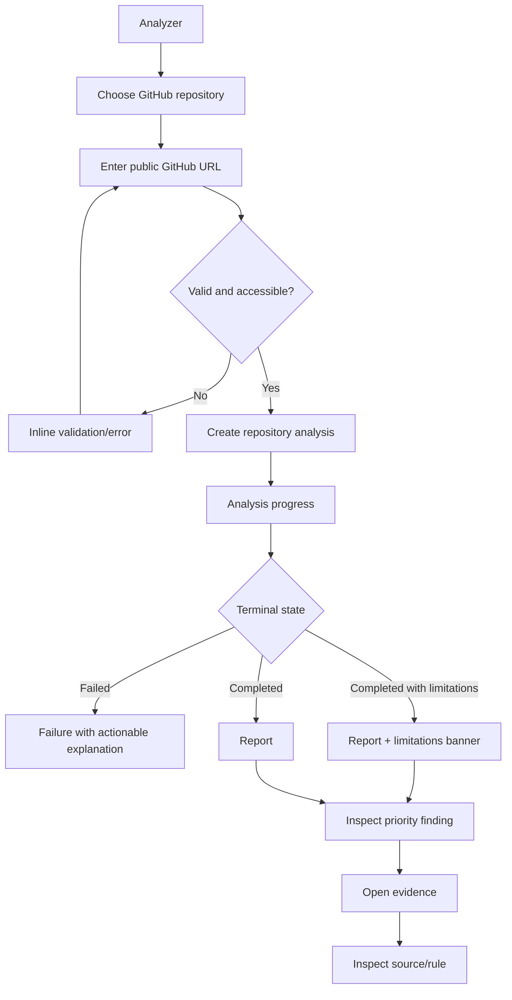
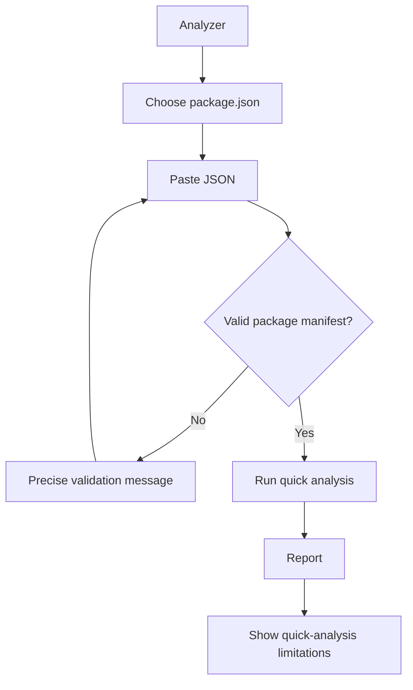
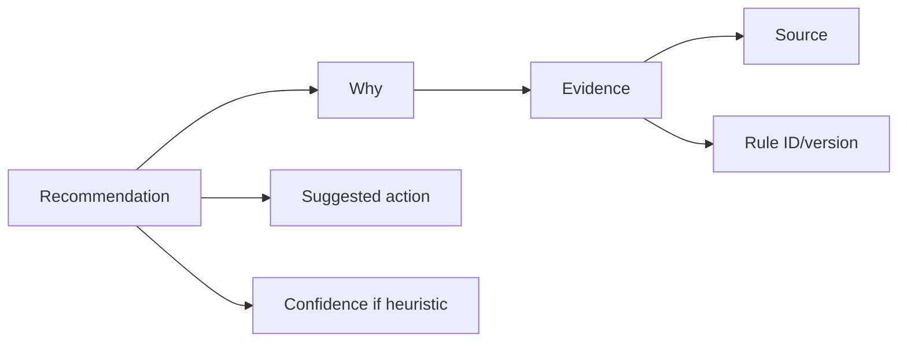
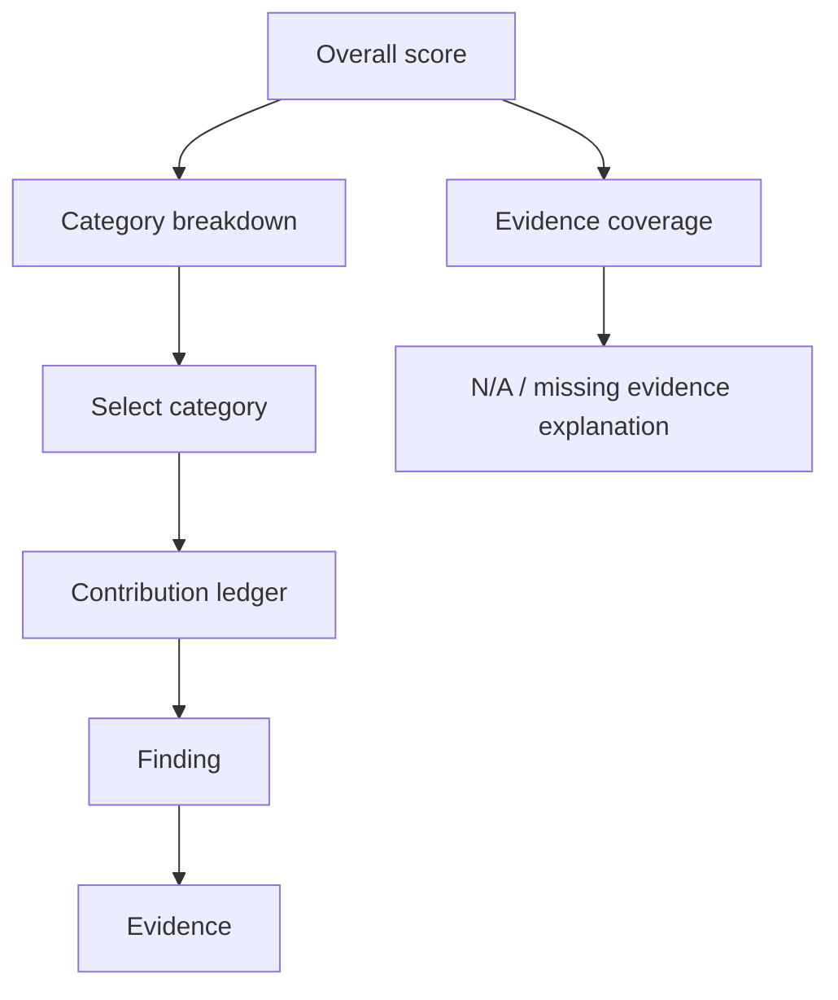

# StackLens MVP User Flows

## Flow A — Public GitHub repository analysis

**Requirements:** FR-003, FR-004, FR-005–FR-021, NFR-008



### UX rules

- Preserve the repository URL after validation errors.
- Do not present fake percentage progress if the backend only knows stage progress.
- Progress language should describe the actual architecture stage.
- Partial provider failures should not look identical to total failure.

## Flow B — Pasted package.json

**Requirements:** FR-001, FR-004, FR-022



### UX rules

The report must not imply source-level certainty. For example:
- package-use heuristics requiring imports may be unavailable;
- vulnerability matching may be N/A when no exact installed version can be established.

## Flow C — Understand a recommendation

**Requirements:** PRD-001, FR-015, FR-017, DATA-001–DATA-006



The user should never need to trust a recommendation solely because "StackLens says so."

## Flow D — Understand a health score

**Requirements:** FR-018–FR-020, SCORE-001–SCORE-004



## Flow E — Narrow viewport

The same product order remains, but report navigation changes:

```text
Report header
Score summary
Attention queue
Category selector (horizontal/combobox)
Selected category content
Limitations
```

A desktop left rail must not be required to understand or operate the report.
