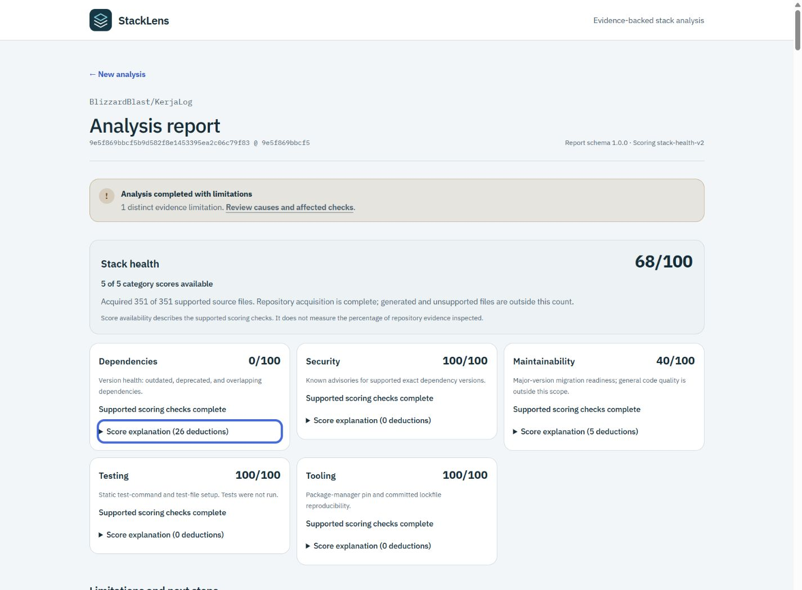
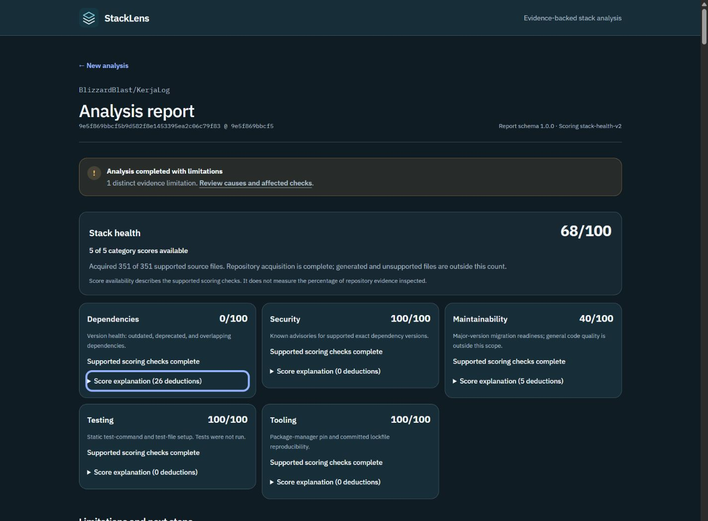

# Evidence and scoring improvements

Requirements: FR-003, FR-006–FR-010, FR-013–FR-021, FR-023, DATA-001–DATA-006,
SCORE-001–SCORE-004, SEC-001, SEC-002, NFR-001–NFR-007, GOV-002–GOV-007.

The KerjaLog report exposed a 32-file acquisition ceiling, rejection of npm's historical
`deprecated: false` representation, unsupported static configuration forms, repeated limitation
messages, and three deliberately unimplemented scoring categories.

Implementation sequence:

1. Accept explicit false deprecation metadata while rejecting other malformed values; exercise
   both historical and current-version records with synthetic responses.
2. Raise the coordinated GitHub budget to 512 files, 520 requests, and 8 MiB retained text.
   Preserve immutable blob reads, deterministic priority, per-file bounds, and honest truncation.
3. Inspect literal ESM/CommonJS configuration exports and local constants through the parser
   adapter. Recognize supported configuration wrappers without executing them; imported presets,
   calls, computed values, and unsupported syntax remain explicitly partial.
4. Introduce scoring v2 with documented scopes: dependency version health, known advisories,
   migration readiness, test setup, and tooling reproducibility. Complete evidence remains required
   for each scored scope; source-usage heuristics retain their own complete-coverage gate.
5. Group identical limitation messages, link N/A scores to their causes, describe old unimplemented
   policies accurately, and replace misleading evidence percentages with score availability and
   observed acquisition information.
6. Run focused regressions, the full quality suite, a fresh repository analysis, and browser checks.
   Update source-of-truth documents, the journey, and the existing pull request.

Scoring policy and acceptance criteria are recorded in ADR-0012 and `docs/requirements.md` before
implementation. Stored v1 reports retain their original values and scoring version.

## Completed verification

PR: [#37](https://github.com/BlizzardBlast/StackLens/pull/37). Repository analyzer/rule-set v3,
`stack-health-v2`; quick composition v3 records the shared recommendation rule v2 while retaining
its unscored, provider-free behavior. The public report schema remains 1.0.0.

- `pnpm check` passes: build, shadcn configuration, typecheck, 319 tests, lint, and formatting.
  All seven persistence and 22 API tests ran against an isolated PostgreSQL 18 database; the
  temporary database was removed. Existing shadcn setup notices remain informational.
- Synthetic regressions cover historical/current npm `deprecated: false`, invalid metadata,
  355/520-file repositories, four-request concurrency with reversed completions, rate-limit stops,
  immutable reads and byte bounds, safe/partial static configuration, custom commands, stale and
  incomplete lockfiles, scoped scoring failures, grouping, zero vs N/A, and legacy policies.
- A fresh provider/orchestration run against KerjaLog commit
  `9e5f869bbcf5b9d582f8e1453395ea2c06c79f83` completed in 51 seconds on this machine, acquiring all
  351 supported source files and all 47 npm packages with no provider failures. This is a single
  observed run, not a performance guarantee. Limitations dropped from 11 to one unresolved ESLint
  preset. No configuration, scripts, dependencies, or tests from KerjaLog were executed.
- The new scoped scores were Dependencies 0, Security 100, Maintainability 40, Testing 100,
  Tooling 100, and Overall 68. Dependency deductions reached the zero floor; the result is evidence
  backed. Testing/Tooling assess setup only, and the Security result is limited to the supported
  exact-version OSV queries. These v2 scores are not directly comparable with v1.
- Browser review replayed the saved historical report and freshly generated report through a local
  response fixture. Both rendered at 320 and 1440 px without horizontal document overflow and with
  one main landmark. Native score disclosures work with Enter; N/A links move keyboard focus to
  the matching group with a visible ring. No browser warnings/errors were recorded.
- Axe color-contrast checks found no text violations in either theme: 435 checked text nodes in
  the collapsed v2 view, 462 in the historical view with N/A links expanded, and 58 in the expanded
  Dependencies card. Existing decorative glyph exceptions remain covered by the earlier
  [contrast audit](../design/contrast-review.md). Browser sizes are emulated, not physical devices.

| Light | Dark |
| --- | --- |
|  |  |

Restart `pnpm dev` to rebuild shared analyzer packages, then submit a new repository analysis.
The original persisted report remains unchanged. Review the PR's merge status and current `main`
HEAD before starting the next change; no post-merge documentation patch is required.
