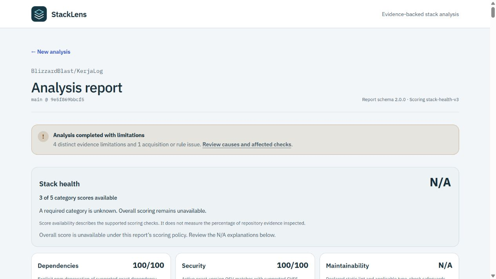

# Public preview validation

> **Status:** Public web/API acceptance passed; operational and manual release gates remain open\
> **Date:** 2026-10-02\
> **Requirements:** PRD-006, FR-001/003/004/022, NFR-004/006/007/008/009, SEC-001/002/003/007, GOV-002/006/007

The personal preview is live at [StackLens web](https://stacklens-web.vercel.app), with a separate
[Fastify API](https://stacklens-api.vercel.app). Both Hobby projects track
`codex/mvp-release-readiness`; Vercel's Production environment label does not establish a product
release. No card or paid plan was added. Aiven credentials belong only to the API and existing Silly
Worker; the web receives only its HTTPS API origin. The GitHub token remains Worker-only.

**Naming follow-up:** The projects are now `stacklens` and `stacklens-api`. Vercel reports that
`stacklens.vercel.app` belongs to another team, so the web address is `stacklens-web.vercel.app`.
Original `project-j0e3o.vercel.app` and `project-q766o.vercel.app` aliases remain attached. The
[naming record](release-evidence/2026-10-02-project-naming.json) distinguishes new-domain checks
from the earlier route/browser evidence below, which retains its observed origins and revisions.

## Deployment and request evidence

Runtime revision `75bf5a2f37d32b98925dd922eb0c6410df3f55fc` passed
[GitHub quality](https://github.com/BlizzardBlast/StackLens/actions/runs/36947487085).
API deployment `Fd6qZs1W8XvuG44FbqZ6upyuT4jW` reached Ready in 27 seconds; web deployment
`BxtVh6H5U5DGpdkAYusTn4k1V3Vp` reached Ready in 14 seconds. The corrected native API entrypoint
exports Fastify's ready, unbound HTTP server and lets Vercel perform binding. Earlier failed builds
and public invocations remain in the [API record](release-evidence/2026-10-02-api-target.json).

Direct API and same-origin web proxy checks passed OpenAPI 200, malformed JSON 400, invalid
repository 400 and unknown API JSON 404. Paste and upload return contract-valid schema 2.0.0
reports with `no-store`; their identifiers return 404 from durable lookup. First observed API
OpenAPI took 3,146 ms; a subsequent request took 58 ms. These are observations, not forced
cold-start or capacity measurements. Shared Aiven initialization retains certificate verification.

The static origin serves JavaScript, CSS and WOFF2 with their expected types. Direct `/quick` and
analysis deep links return the application document; missing assets return 404. Public API JSON
errors remain JSON through the proxy. Source-free identifiers, immutable commits, timing bases,
failure codes and browser observations are in the [public record](release-evidence/2026-10-02-public-preview.json).

## Repository and browser acceptance

| Repository | Immutable commit | Direct API outcome | Fresh web-form outcome |
| --- | --- | --- | --- |
| frey-ui | `6dbd184ace64d28c6a7ca7c2c75263215f4ac9bf` | Completed with limitations: 24 limitations, three bounded npm failures | Completed with limitations: 25 limitations, two GitHub blob failures and three bounded npm failures |
| KerjaLog | `9e5f869bbcf5b9d582f8e1453395ea2c06c79f83` | Completed with limitations: five limitations, no provider failures | Completed with limitations after Worker restart: six limitations, one GitHub blob timeout |

Both paths validate reports with shared contracts, preserve explicit unknown score states and use
the remote Worker rather than executing analyzed repository code. Direct API observations took
136,505 ms and 242,076 ms including queue wait. Durable timestamps are recorded separately;
report `createdAt` is not a completion duration. Provider responses can differ between runs.

Actual browser checks cover both repository forms, named progress stages, a missing repository's
terminal failure and recovery link, missing-analysis recovery, stable report reload, evidence
open/Close with focus returned to its trigger, invalid manifest preservation, quick busy state,
result-heading focus and reset-heading focus. Native file selection was exercised: replacing an
83-byte manifest with a 110-byte manifest produces the replacement's two dependencies. One upload
request is observed; its quick identifier is not persisted.

At an emulated 320 × 800 viewport, quick and KerjaLog reports have a 305 px client width and
305 px scroll width, including the browser scrollbar. No horizontal overflow is observed. After
the terminal KerjaLog deep link loads, CDP observes one status request and zero additional status
requests over 62 seconds; the normal nonterminal interval is 1,500 ms. No console errors were
captured in that observation. Viewport and network inspection overrides were reset.

## Worker restart gap and next release work

The Silly panel Restart stopped the old Worker and brought up a new Worker. The active KerjaLog
analysis remained `running` instead of promptly recovering. It was still running at
01:05:55 UTC. A later terminal reread succeeds; durable completion is 05:04:53 UTC, 15,044,783 ms
(4 h 10 m 44.783 s) after submission. No manual unlock was executed. A prepared recovery editor
was not saved or run. The elapsed timing is consistent with
[Graphile's documented stale-lock recovery](https://worker.graphile.org/docs/error-handling);
it does not prove a continuously observed recovery trigger or prompt failover.

Do not use panel Restart during active work as if it were a graceful drain. Drain before planned
maintenance. For an unexpected exit, confirm the exact old Worker is dead before using
[Graphile's supported administrative unlock](https://worker.graphile.org/docs/admin-functions).
Never unlock a live Worker, all queue jobs, or an identifier inferred only from a slow public stage.
Keep this operator action outside the public API and analyzer. Prompt recovery requires a separately
reviewed shutdown/host-supervision solution and an active-job acceptance rerun.

A panel sample reached 257.36 MiB against the displayed 256 MiB cap. This is not a measured cgroup
peak or proof that OOM never occurred. Sanitized pool/retention errors were also visible in the
historical console. Worker capacity and recovery latency remain release risks; completing reports
does not close them. Function pool suspension, aggregate autoscaling connections, remote expiry,
backup restore, actual screen-reader output, a physical narrow/touch device and another browser
engine remain unverified. Follow the [manual guide](manual-release-validation.md) for human checks.

PR #41 stays draft and unmerged. Resolve its current HEAD and main before review or merge.
Documentation publication may rebuild both projects; recheck their actual deployment states and
public requests on that HEAD. Preserve this dated runtime evidence rather than replacing its source
revision with an unknowable future commit.
